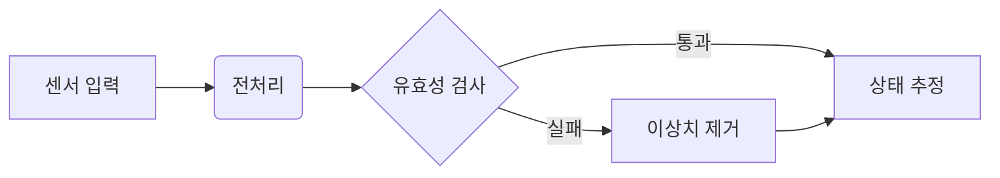
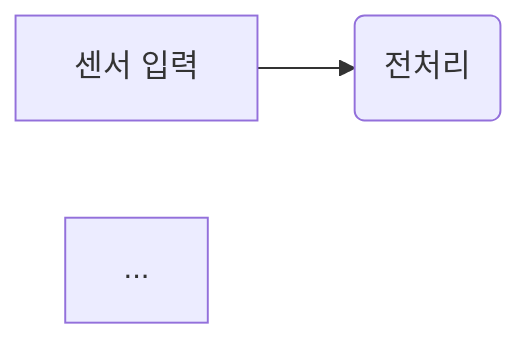

이 글은 새 포스트를 쓸 때 참고하는 템플릿입니다. 각 절마다 **렌더링된 결과**와 **소스 코드**를 함께 보여줍니다. 글을 쓸 때 이 파일(`_posts/2026-06-12-post-template.md`{: .filepath})을 열어 필요한 부분을 복사하세요.

## Front Matter

모든 포스트 맨 위에 들어가는 블록입니다. `math`, `mermaid`, `image`는 필요할 때만 켜세요.

```yaml
---
title: "포스트 제목"
description: 검색 결과와 미리보기에 표시되는 한 줄 요약
date: 2026-06-13 14:00:00 +0900   # +0900 필수, 미래 시각이면 글이 안 보임
categories: [Robotics, SLAM]      # [대분류, 소분류] 최대 2단계
tags: [ros2, lidar]               # 소문자 권장
math: true                        # 수식 쓸 때만
mermaid: true                     # 다이어그램 쓸 때만
# pin: true                       # 홈 상단 고정
# image:                          # 대표 이미지 (목록 썸네일 + 본문 상단)
#   path: /assets/img/posts/foo/cover.png
#   alt: 이미지 설명
---
```

## 수식 (Math)

front matter에 `math: true`가 필요합니다. 인라인 수식은 $$ \mathbf{x}_{t+1} = f(\mathbf{x}_t, \mathbf{u}_t) $$ 처럼 문장 안에 들어가고, 번호가 붙는 블록 수식은 아래처럼 씁니다.

$$
\begin{equation}
  J(\theta) = \mathbb{E}_{\tau \sim \pi_\theta} \left[ \sum_{t=0}^{T} \gamma^t r(s_t, a_t) \right]
  \label{eq:objective}
\end{equation}
$$

본문에서 식 \eqref{eq:objective} 처럼 참조할 수 있습니다.

**소스:**

```text
인라인: $$ \mathbf{x}_{t+1} = f(\mathbf{x}_t, \mathbf{u}_t) $$

블록(번호 + 참조 가능):
$$
\begin{equation}
  J(\theta) = ...
  \label{eq:objective}
\end{equation}
$$

참조: \eqref{eq:objective}
```

## 코드 블록

언어를 지정하면 문법 강조가 되고, `file=` 속성으로 파일명을 표시할 수 있습니다.

```python
import numpy as np

def ekf_predict(x, P, F, Q):
    """EKF 예측 단계"""
    x_pred = F @ x
    P_pred = F @ P @ F.T + Q
    return x_pred, P_pred
```
{: file="src/ekf.py" }

**소스:**

````text
```python
import numpy as np
...
```
{: file="src/ekf.py" }
````

인라인 코드는 `ros2 topic list`, 파일 경로는 `/opt/ros/humble/setup.bash`{: .filepath} 로 씁니다 (경로는 뒤에 `{: .filepath}`를 붙임).

## 프롬프트 박스 (강조 상자)

> 유용한 팁을 적을 때 씁니다.
{: .prompt-tip }

> 부가 정보를 적을 때 씁니다.
{: .prompt-info }

> 주의할 점을 적을 때 씁니다.
{: .prompt-warning }

> 치명적인 함정을 적을 때 씁니다.
{: .prompt-danger }

**소스:** 인용문 뒤에 클래스를 붙입니다.

```text
> 유용한 팁을 적을 때 씁니다.
{: .prompt-tip }

종류: .prompt-tip / .prompt-info / .prompt-warning / .prompt-danger
```

## 이미지

이미지는 `assets/img/posts/<글이름>/`{: .filepath} 폴더에 넣고 절대 경로로 참조합니다. 너비를 지정하고 바로 아랫줄에 *기울임* 텍스트를 쓰면 캡션이 됩니다.

{: width="640" }
_그림 1. 감쇠 사인파 — 캡션은 이미지 바로 아랫줄에 기울임체로 쓴다_

**소스:**

```text
{: width="640" }
_그림 1. 캡션 내용_

정렬 옵션: {: .normal } (좌측), {: .right } / {: .left } (본문 감싸기)
다크/라이트 모드 분리: {: .light } 또는 {: .dark } 를 각각 붙여 두 장 삽입
```

## Mermaid 다이어그램

front matter에 `mermaid: true`가 필요합니다.



**소스:**

````text

flowchart / sequenceDiagram / gantt / classDiagram 등 지원
````

## 표

| 방법 | ATE RMSE (m) | 실시간 여부 |
| :--- | ---: | :---: |
| ORB-SLAM3 | 0.035 | O |
| 제안 기법 | **0.021** | O |

**소스:**

```text
| 방법 | ATE RMSE (m) | 실시간 여부 |
| :--- | ---: | :---: |       <- :--- 좌측, ---: 우측, :---: 중앙 정렬
| ORB-SLAM3 | 0.035 | O |
```

## 각주와 인용

논문을 인용할 때는 각주[^mur2017]를 쓰고, 여러 번 인용해도 됩니다[^mur2017]. 다른 각주도 자유롭게 추가합니다[^note].

> 들여쓴 인용문은 이렇게 표시됩니다. 논문의 한 구절을 옮길 때 유용합니다.

**소스:**

```text
본문에서 각주[^mur2017]를 답니다.

글 맨 아래에 정의:
[^mur2017]: Mur-Artal, R., & Tardós, J. D. (2017). ORB-SLAM2. IEEE T-RO.
```

## 목록

- 일반 목록
  - 들여쓰기는 공백 2칸
1. 순서 목록
2. 두 번째

할 일 목록:

- [x] 데이터셋 수집
- [ ] 베이스라인 실험
- [ ] 논문 초안

## 동영상

유튜브 영상은 아래 한 줄로 삽입합니다 (id는 영상 URL의 `v=` 뒷부분).

```text

```

로컬 동영상 파일은 `assets/video/`{: .filepath}에 넣고:

```text

```

## 올리기

```bash
git add _posts/2026-06-13-새글.md assets/img/posts/새글/
git commit -m "Add post: 새 글 제목"
git push   # 1~2분 후 자동 배포
```

---

[^mur2017]: Mur-Artal, R., & Tardós, J. D. (2017). ORB-SLAM2: An Open-Source SLAM System for Monocular, Stereo, and RGB-D Cameras. *IEEE Transactions on Robotics*, 33(5), 1255–1262.
[^note]: 각주는 이렇게 글 맨 아래에 모아서 정의하며, 본문과 자동으로 양방향 링크가 생깁니다.
